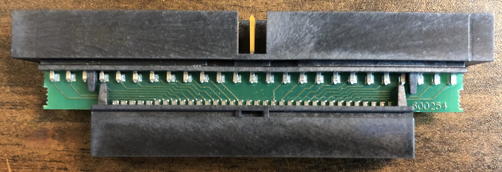
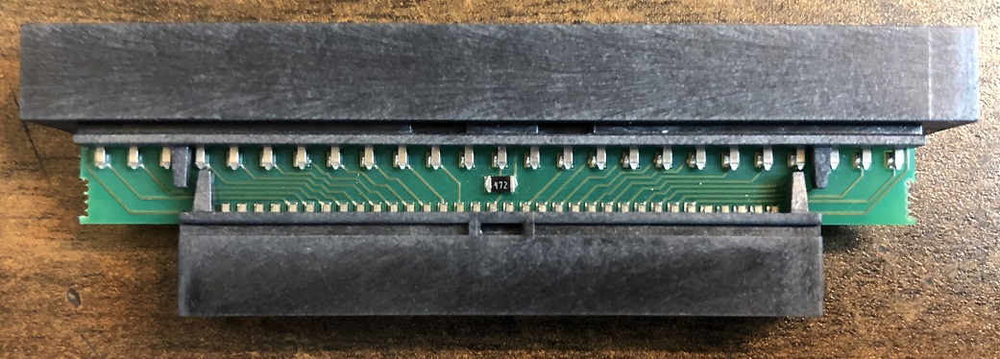
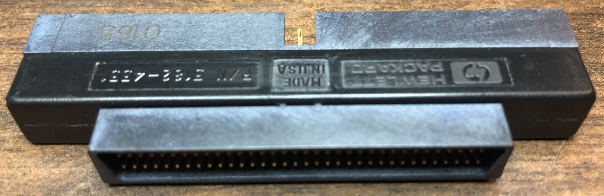

Reverse engineered schematic for the HP/Agilent 5182-4551 50-pin to 68-pin SCSI adapter  
Connects 68-pin SCSI device to SCSI host adapter through 50-pin cable

Note that the upper 8-bits and its parity bit are tied together and pulled up to TERMPWR with a 4.7K ohm resistor (others adapters do this differently, such as tying to GND, which I believe causes compatibility issues).

Also note that common pins (such as GND) aren't tied together.  Presumably this is to support both single ended and (HV) differential.  High voltage differential has a slightly different pinout (in addition to being differential), but it looks like this adapter would support both HVD and SE.  I don't believe a 50-pin LVD standard was ever used (though based on the pinout similarities of the 68-pin side, it should work if there is).  This adapter should work to connect a 68-pin Multimode Single Ended (MSE) device to a 50-pin SE host adapter cable.

