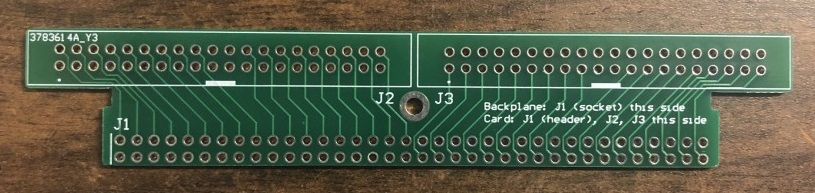
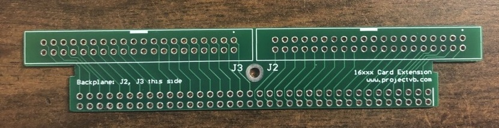
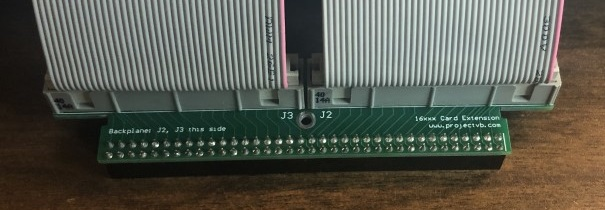
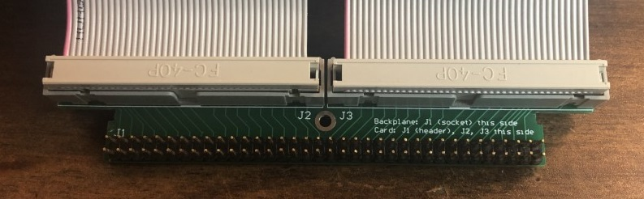
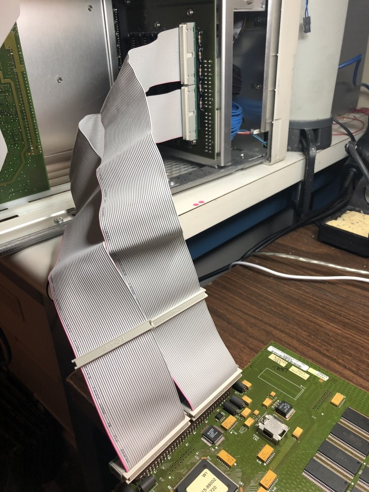
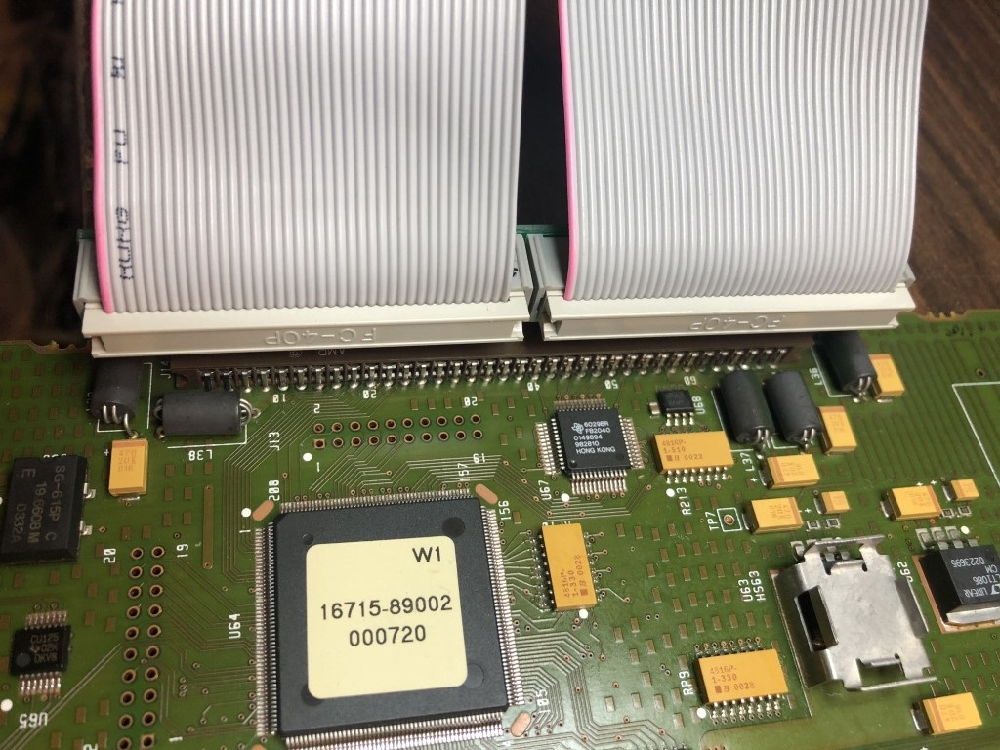
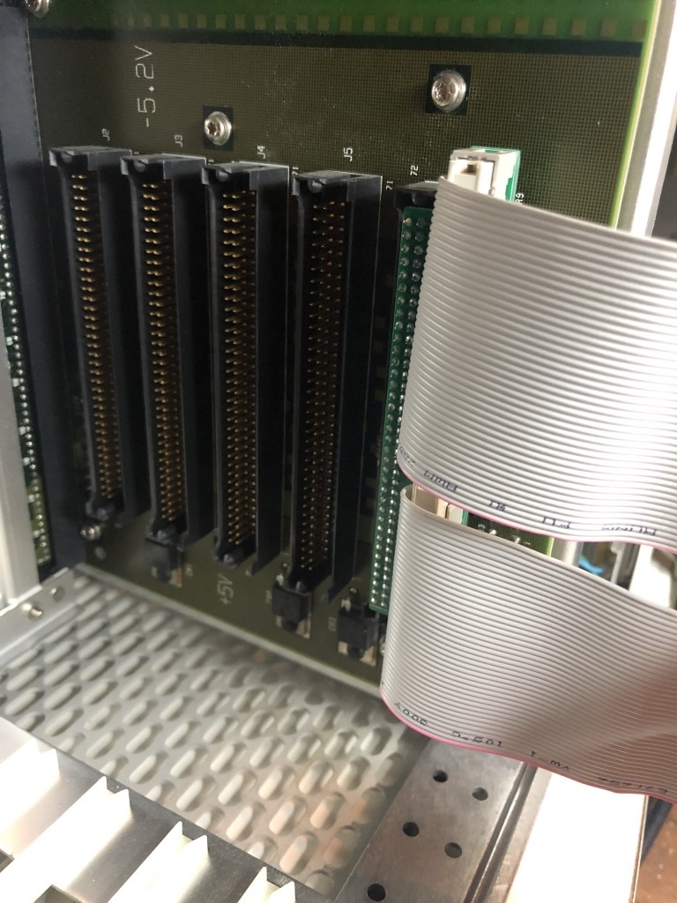
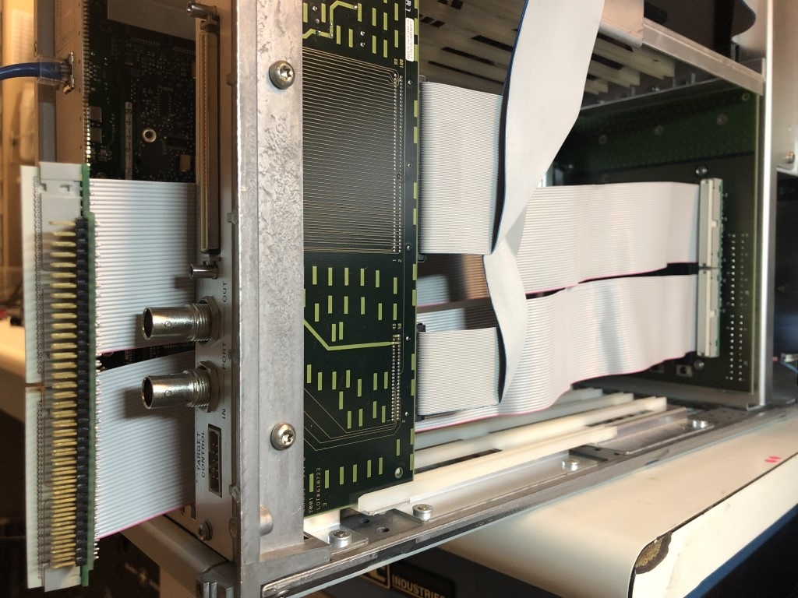
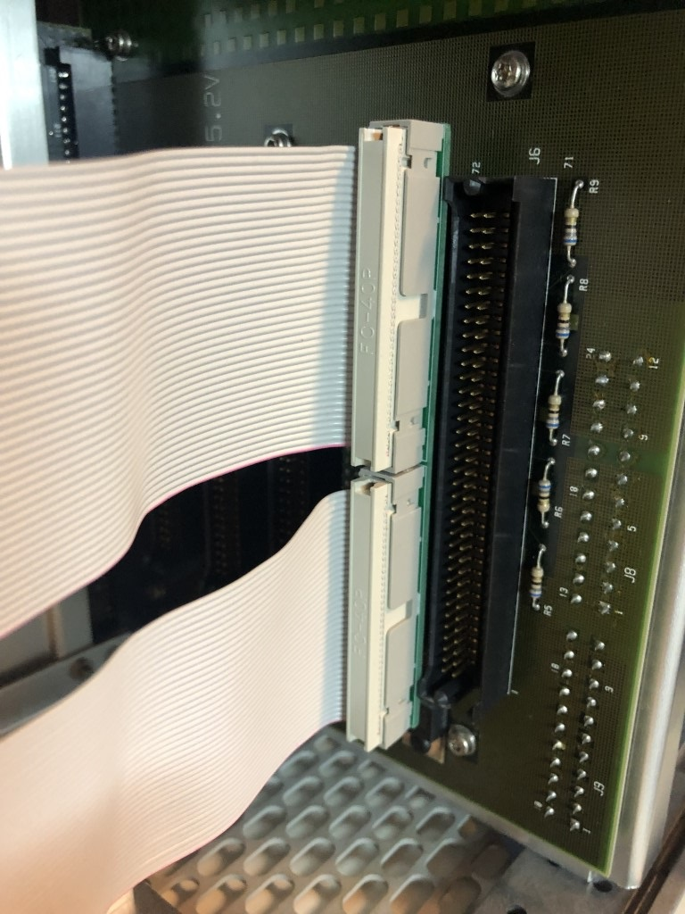
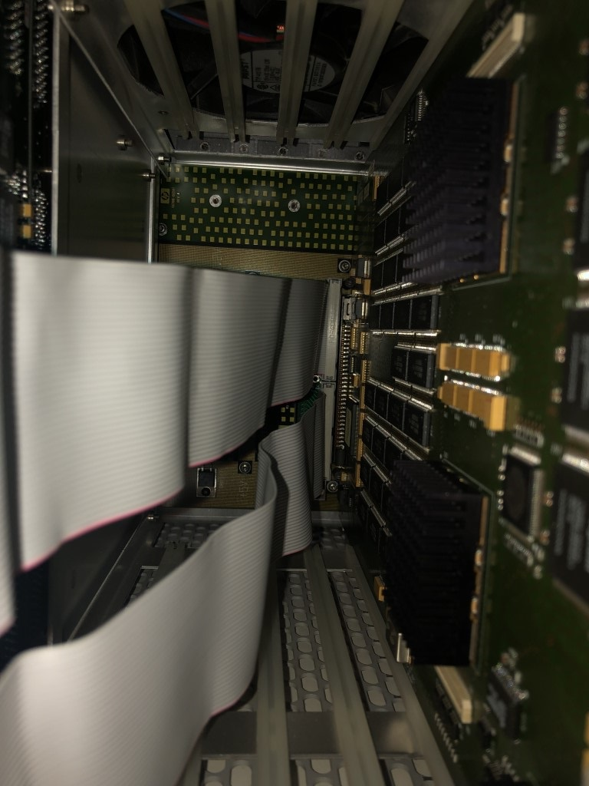

# HP/Agilent 16xxx Card Extension
## Overview

Extension for HP 16700 cards and similar systems (should be the same for 16500 and 16900 series')
-Only tested on 16702B

Allows connecting card outside of chassis for troubleshooting/repair
-chassis has fans to cool cards, must ensure sufficient cooling for card if using outside chassis

Original connector is dual row, 72-pin, 0.1" pitch connector (male on backplane, female on card)

Uses 2x 40-wire ribbon cables for extension
-Pin 20 not used, so pin can be removed to be compatible with commonly available IDE cables with pin 20 plugged
-**Do NOT use with 80-wire "Ultra ATA" IDE cables or DAMAGE is likely (cables have internal connections across several pins)**
-only 72 of 80 pins used, additional pins can be jumpered if needed for added current capacity

Unknown how long cables can be before reliability issues (17" cables tested)

## Assembly Instructions

Assembly is straight forward, pay attention to markings on silkscreen
-J1 is populated with a 72-pin 0.1" pitch socket on backplane end
-J1 is populated with a 72-pin 0.1" pitch header on card end
-J2 and J3 are populated with 40-pin 0.1" pitch shrouded headers on both

**Make sure shroud notch and/or pin 1 matches the silkscreen on the side connector is installed on**
-In order to have cable on parts side of card, connectors are flipped between top and bottom

**Recommend to use ohmmeter to verify correct assembly, incorrect assembly will likely cause damage to card or analyzer**

### Backplane side

-J1 socket installs on top side of PCB (side labeled "Backplane: J1 (socket) this side)
-J2 and J3 headers install on bottom side of PCB (side labeled "Backplane: J2, J3 this side)

### Card side

-J1, J2, and J3 headers install on top side of PCB (side labeled "Card: J1 (header), J2, J3 this side)

## Images

